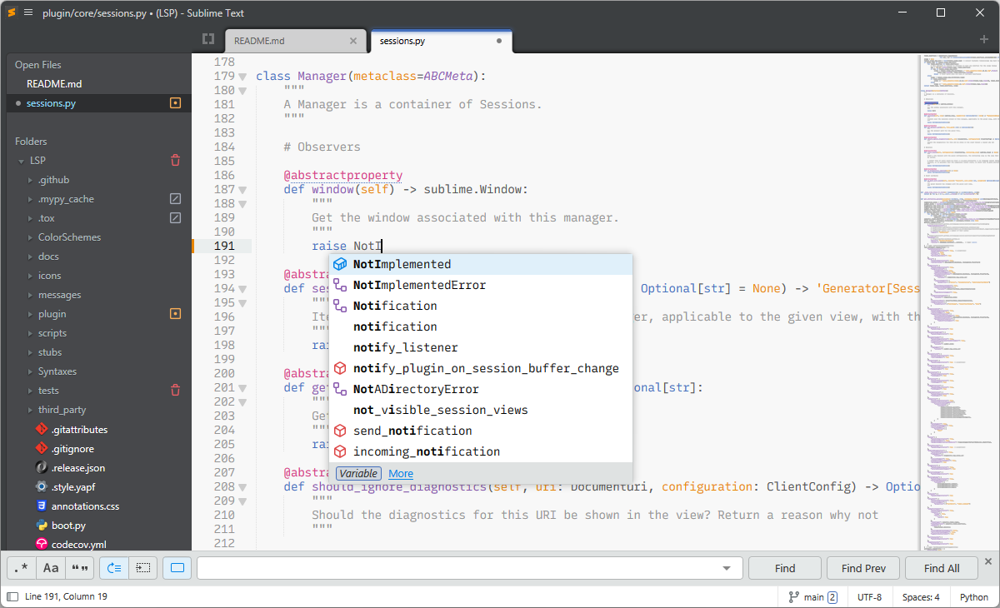

# Brackets Theme for Sublime Text

A theme for Sublime Text inspired by Adobe Brackets.

This package only controlls the look of the user interface in Sublime Text.
For the according syntax highlighting schemes also see my [Brackets Color Scheme](https://github.com/jwortmann/brackets-color-scheme), which can be installed independently.

## Installation

The theme requires Sublime Text build 4107 or newer.
It can be installed with Sublime Text's package manager [Package Control](https://packagecontrol.io/installation).
From the command palette select *Package Control: Install Package* and search for *Theme - Brackets*.

## Preview

## Customization

Various theme-related settings defined by Sublime Text, as well as a few custom settings specific to this theme are supported to tweak the appearance.
All settings should be modified in the *Preferences.sublime-settings* file.

__Custom settings:__

| Setting | Default | Description |
| ------- | ------- | ----------- |
| "kind_letters" | false | Use the default style with colored kind letters instead of icons in autocompletion popups and the *Goto Symbol…* panel. |
| "sidebar_status_colors" | false | Highlight filenames in the sidebar for files with Git status "new" or "modified" in green and orange. Regardless of this setting, files with status "ignored" are always dimmed. |
| "hide_sidebar_status_icons" | false | Hide the Git status icons in the sidebar. |

__Relevant standard settings:__

| Setting | Default | Description |
| ------- | ------- | ----------- |
| "themed_title_bar" | true | Controls if a custom or default title bar is used. |
| "file_tab_style" | "rounded" | Controls the style of file tabs. Options: "rounded", "square", "angled". |
| "inactive_sheet_dimming" | true | If inactive sheets should have their background slightly modified to make input focus more obvious. |
| "highlight_modified_tabs" | false | Makes tabs with modified files more visible. |
| "overlay_scroll_bars" | "system" | Valid values are "system", "enabled" and "disabled". |
| "hide_tab_scrolling_buttons" | false | Hides the buttons for scrolling tabs left/right, requiring use of a trackpad or mouse scroll wheel. |

## Attributions

* Kind icons used in the autocompletion popup and the *Goto Symbol…* panel, as well as icons indicating the Git status for sidebar entries are adapted from Microsoft's [Codicons](https://github.com/microsoft/vscode-codicons) icon font (licensed under [CC BY 4.0](/licenses/Codicons/LICENSE)).

* File icons in the sidebar are derived from [braver/FileIcons](https://github.com/braver/FileIcons) (licensed under the [MIT license](/licenses/FileIcons/LICENSE)).
